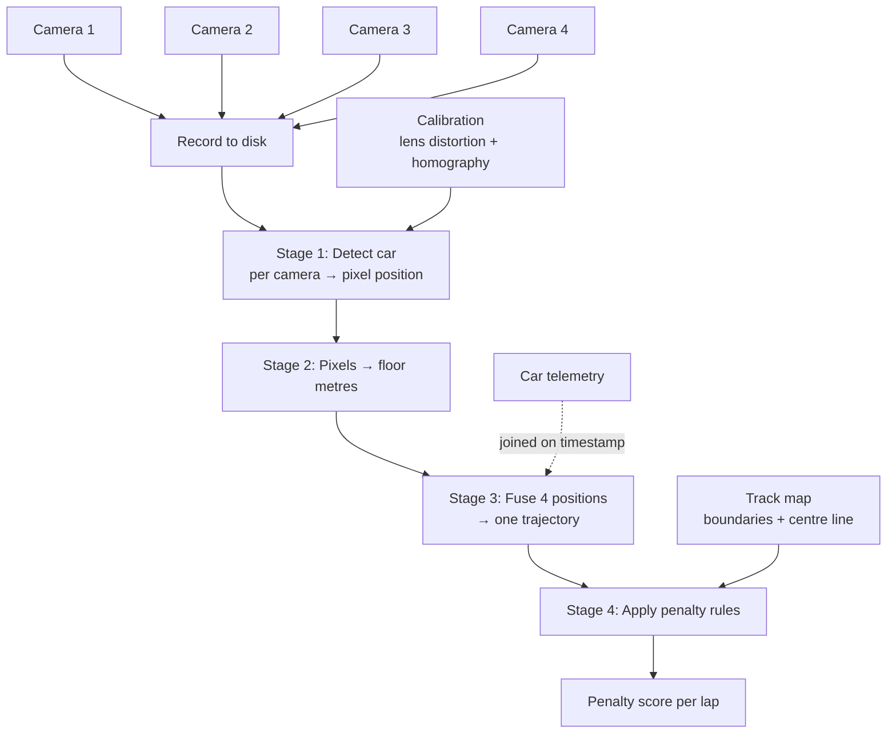

# Architecture

## Overview

This is just from my research and of course feel free to edit.

The system answers one question: **where was the car at each moment, and
was that legal?**

It does this in four stages. I think only the first uses machine learning.



## What is and isn't machine learning

| Stage | Does what | ML? |
|-------|-----------|-----|
| 1. Detect | Finds the car in a frame, outputs a pixel position | **Yes** - the only model |
| 2. Locate | Converts pixels to real floor coordinates | No - geometry |
| 3. Fuse | Combines four camera estimates into one trajectory | No - arithmetic |
| 4. Judge | Compares trajectory against track rules | No - explicit code |

The penalty logic is deliberately rule-based. A penalty system must be
able to explain every decision it makes.

## Stage detail

### Stage 1 - Detection

Input: one video frame. Output: the car's position in that image.

Options under consideration, from simplest to most capable:

- **Classical CV** (background subtraction / colour) - no training, works
  immediately, breaks under lighting changes. Useful as a week-1 placeholder.
- **ArUco marker on the car** - no training, very accurate, additionally
  provides orientation, but requires modifying the car.
- **Trained detector** - no car modification, handles occlusion better,
  requires labelled data.

A combo we can explore: an ArUco marker to generate training labels
automatically, train a marker-free detector on them, and evaluate the
detector against the marker as ground truth. This removes the manual
annotation phase and provides an objective accuracy baseline.

Model licensing needs a decision before we commit to one.

Ultralytics YOLO (YOLO11, YOLO26) is AGPL-3.0: if we publish work built
on it, our own code must also be released under AGPL. That may be fine
for a university project, but it is the lab's call, not ours.

RF-DETR (Apache 2.0) and RTMDet (MIT) have no such requirement - we can
publish or keep the code private as we choose.

### Stage 2 - Pixels to metres

Two corrections, applied in order:

1. **Lens distortion** - camera lenses bend straight lines, worst at the
   frame edges. Corrected using a ChArUco calibration board. Done once per
   camera.

2. **Homography** - a 3x3 matrix mapping image pixels to floor coordinates.
   Computed from at least four points whose real positions are measured on
   the floor. Use 8-12 spread across the area for accuracy.

#### The height problem

A homography assumes everything lies flat on the floor. The car does not -
it is 10-15 cm tall. Projecting the car's visible centre onto the floor
plane places it **further from the camera than it actually is**, and the
error is systematic rather than random.

Some suggested solutions:

- Track the car's ground contact (bottom edge of the detection, or a
  wheelbase keypoint) rather than its centre.
- Mount cameras as close to overhead as possible. Oblique angles amplify
  the error, and this cannot be fixed in software afterwards.

```
  OVERHEAD (good)              OBLIQUE (worse)

      [cam]                    [cam]
        |                          \
        |                           \
        |                            \
    ----+----                    -----\---
      floor                        floor

   error: small                 error: large
```

- Ensure camera views overlap so the same car is seen twice and the
  disagreement between cameras can be measured.

### Stage 3 - Fusion

Detection runs **independently per camera**. Each result is converted to
floor coordinates using that camera's own homography, so all four land in
the same coordinate system. Only then are they combined.

Images are never stitched together - combining four numbers is trivial,
combining four images is not, and nothing here needs a panorama.

Combination options: median (robust to one bad camera), weighted average
(weight by detection confidence or proximity to image centre), or a Kalman
filter (uses motion continuity to smooth the path and bridge gaps where
the car is hidden).

**Disagreement between overlapping cameras is the system's accuracy
metric.** This is the main reason overlap matters.

### Stage 4 - Penalty rules

The track does not move, so its geometry is defined once by hand in
`configs/track.yaml` - outer boundary, inner boundary, centre line, all in
metres. No model is needed to find the track.

Rules live in `configs/penalties.yaml` so they can be changed without
touching code. Because processing is offline, changing a rule and
re-scoring every recording takes minutes.

Open design questions:

- Penalty per frame or per event? At 30 fps a two-second excursion is 60
  frames; charging per frame gives a very different result from charging
  per event.
- Hysteresis, so a car wobbling on the boundary does not trigger many
  separate events.
- Is a lap score the sum of penalties, the worst single event, or an average?

## Evaluation

Two things:

**Detector quality** - standard detection metrics (mAP, precision, recall)
on frames held out from training.

**System quality** - the actual deliverable:

- Positional accuracy in centimetres, against marker ground truth or
  cross-camera agreement.
- Agreement with human judgement: hand-score several laps and compare.
- Robustness across the lighting conditions recorded.

Test recordings must be set aside at the start and never used for training
or tuning. Split by **session**, not by frame - frames from the same lap
are near-duplicates, so splitting by frame leaks information.
