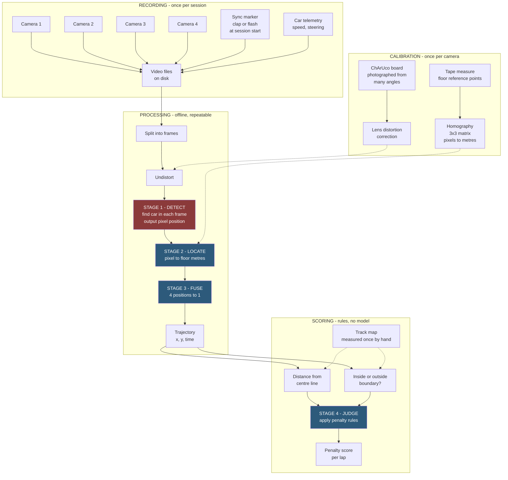

# Project plan

Draft for discussion. Nothing here is decided - the point is to have
something concrete to argue with.

**Contents**

1. [What we are building](#1-what-we-are-building)
2. [Full pipeline](#2-full-pipeline)
3. [Two orders, do not confuse them](#3-two-orders-do-not-confuse-them)
4. [Stage 1 - Detection](#4-stage-1---detection)
5. [Stage 2 - Pixels to metres](#5-stage-2---pixels-to-metres)
6. [Stage 3 - Fusion](#6-stage-3---fusion)
7. [Stage 4 - Penalty rules](#7-stage-4---penalty-rules)
8. [Evaluation](#8-evaluation)
9. [Where we actually are](#9-where-we-actually-are)
10. [Plan from here](#10-plan-from-here)
11. [The biggest open question](#11-the-biggest-open-question-can-we-mark-the-car)
12. [Two things we cannot fix later](#12-two-things-we-cannot-fix-later)
13. [The car](#13-the-car)
14. [Suggested roles](#14-suggested-roles)
15. [Questions for tomorrow](#15-questions-for-tomorrow)

---

## 1. What we are building

**We want to know where the car was at every moment, and whether that was
legal.**

A camera does not know what a car is - a video frame is just a grid of
coloured dots. So we go from "grid of dots" to "penalty score" in four
stages.

| Stage | Question it answers | How | ML? |
|-------|--------------------|-----|-----|
| 1. Detect | Where is the car **in the picture**? | Look at the frame, output a pixel position | **Yes - the only model** |
| 2. Locate | Where is that **on the floor**? | Geometry (homography) | No |
| 3. Fuse | What did **all four** cameras say? | Combine 4 positions into one | No |
| 4. Judge | Was that **legal**? | Compare against the track map | No - plain code |

**Only stage 1 is machine learning.** Its entire job is to find the car in
a picture. Nothing more.

Stage 4 is deliberately not a model. If the coach asks "why -50 here?", we
must point at a rule, not shrug at a neural network.

Two decisions already made:

- **Offline, not real time.** Cameras record to disk, we process
  afterwards. Any mistake is recoverable by re-running the same video, we
  can use slow accurate models, and changing a rule in week 7 means
  re-scoring everything in minutes.
- **Output must be publishable.** This affects which detection model we
  can use (section 4).

---

## 2. Full pipeline



**Red = machine learning. Blue = ordinary code.**

Two things worth noting from the diagram:

- **Calibration is separate from processing.** Done once per camera, then
  reused for every recording. If a camera moves, it must be redone.
- **The track map is measured by hand, not detected.** The track does not
  move, so no model is needed to find it.

---

## 3. Two orders, do not confuse them

**Pipeline order** - how data flows when the system runs:

```
detect -> locate -> fuse -> judge
```

Detection is first because nothing can happen until we know where the car
is in the image.

**Build order** - the sequence we work in:

```
calibration -> geometry -> rules -> THEN the model
```

The model comes near the end.

**Both are true.** Detection is stage 1 in the pipeline and one of the last
things we build.

### Why we can build out of order

Detection is a **replaceable box**. Everything after it only needs one
thing: *"the car is at pixel (812, 447)"*. It does not care how we got
that number.

So we fill that box with something crude immediately, and swap in the
trained model later:

| When | What fills the box | Quality |
|------|-------------------|---------|
| Early | Coloured marker, or background subtraction | Rough, works |
| Later | Trained model | The real thing |

Stages 2, 3 and 4 are identical either way.

Building the model first would mean no working system until the very end,
and no way to test whether the geometry is even right.

> Like building a car: the engine is what makes it move, but you build the
> chassis and steering first, drop in a cheap engine to check it drives,
> then fit the real one.

---

## 4. Stage 1 - Detection

Input: one video frame. Output: the car's position in that image.

Options, simplest to most capable:

- **Classical CV** (background subtraction / colour) - no training, works
  immediately, breaks under lighting changes. Useful as a placeholder.
- **ArUco marker on the car** - no training, very accurate, additionally
  gives orientation, but requires modifying the car.
- **Trained detector** - no car modification, handles occlusion better,
  requires labelled data.

A combination worth exploring: use an ArUco marker to generate training
labels automatically, train a marker-free detector on them, and evaluate
the detector against the marker as ground truth. This removes the manual
annotation phase and gives an objective accuracy baseline. See section 11.

### Model licensing

Needs a decision before we commit.

Ultralytics YOLO (YOLO11, YOLO26) is **AGPL-3.0**: if we publish work
built on it, our own code must also be released under AGPL. That may be
perfectly fine for a university project, but it is the lab's call.

RF-DETR (Apache 2.0) and RTMDet (MIT) have no such requirement.

### How much data

Fine-tuning means starting from a model already trained on millions of
general images and continuing training on ours - which is why we need
thousands of examples rather than millions.

A comparable published study fine-tuned on about 2,300 images and reached
roughly 98% mAP50 for marker localisation on a ground robot. Consecutive
video frames are near-identical and teach almost nothing, so sample
sparsely and prioritise variety over volume.

---

## 5. Stage 2 - Pixels to metres

Two corrections, applied in order.

**1. Lens distortion.** Camera lenses bend straight lines, worst at the
frame edges. Left uncorrected, the same car appears at different apparent
positions depending where in frame it is. Corrected using a ChArUco board
(a chessboard with ArUco markers in the white squares - it tolerates
partial views, unlike a plain chessboard). Photograph it 20-30 times per
camera from varied angles. Done once per camera.

**2. Homography.** A 3x3 matrix mapping image pixels to floor coordinates.
This is the core idea of the whole project: the track is flat, so there is
a fixed mathematical relationship between where something appears in the
image and where it is on the floor.

How it is computed:

1. Mark points on the floor that cameras can see (tape crosses, corners)
2. **Measure their real positions with a tape measure**
3. Click those same points in each camera's image
4. `cv2.findHomography` gives the matrix
5. Afterwards, `cv2.perspectiveTransform` converts any pixel to metres

Use 8-12 points spread across the whole area, not the minimum of 4 - extra
points let the solver average out measurement error. **Sloppy tape
measuring becomes sloppy penalties.**

### The height problem

A homography assumes everything lies flat on the floor. The car does not -
it is 10-15 cm tall. Projecting the car's visible centre onto the floor
plane places it **further from the camera than it actually is**, and the
error is *systematic* rather than random, so averaging will not remove it.

The error grows with object height, with distance from the image centre,
and with steeper (more oblique) camera angles.

Mitigations:

- Track the car's ground contact (bottom edge of the detection, or a
  wheelbase keypoint) rather than its centre. The wheels are genuinely on
  the floor plane; the roof is not.
- Mount cameras as close to overhead as possible.
- Ensure camera views overlap, so the same car is seen twice and the
  disagreement can be measured.

```
  OVERHEAD (good)              OBLIQUE (worse)

      [cam]                    [cam]
        |                          \
        |                           \
        |                            \
    ----+----                    -----\---
      floor                        floor

   error: small                 error: large
```

---

## 6. Stage 3 - Fusion

Detection runs **independently per camera**. Each result is converted to
floor coordinates using that camera's own homography, so all four land in
the same coordinate system. Only then are they combined.

**Images are never stitched together.** Combining four numbers is trivial;
combining four images (parallax, blending, alignment) is hard and buys us
nothing.

Combination options:

| Method | Notes |
|--------|-------|
| Average | Simplest. One bad camera drags the result. |
| Median | Automatically ignores a single wild outlier. Robust. |
| Weighted average | Weight by detection confidence or proximity to image centre |
| Kalman filter | Uses motion continuity - a car cannot teleport - to smooth the path and bridge gaps where the car is hidden |

Start with median or weighted average. Add a Kalman filter later if the
path looks jittery, or to handle occlusion.

**Disagreement between overlapping cameras is the system's accuracy
metric.** If two cameras both see the car and differ by 3 cm, the system
is roughly 3 cm accurate. This is the number to report, and the main
reason overlap matters.

### Synchronisation

Four cameras recording independently will drift. How much precision we
need depends on speed:

> A car at 2 m/s moves 2 cm per 10 ms. For ~5 cm agreement we need sync
> within roughly 25 ms.

That is a loose requirement. NTP over a LAN typically achieves 3-5 ms
across 4-8 cameras, which is comfortably enough. Phones cannot use NTP, so
we sync on a physical event instead - a clap or flash at the start of
every session, aligned afterwards in the footage.

Either way, **record a physical sync marker every session** so alignment
can be verified rather than assumed.

---

## 7. Stage 4 - Penalty rules

The track does not move, so its geometry is defined once by hand in
`configs/track.yaml` - outer boundary, inner boundary, centre line, all in
metres. **No model is needed to find the track.** Someone will suggest
segmenting it per frame; that is unnecessary work.

We also need the car's physical width, because "touching the boundary"
means the car's *edge*, not its centre point.

Rules live in `configs/penalties.yaml` so they can be changed without
touching code. The values from the blackboard (-10 / -50 / -100) are a
starting point to tune.

The geometry needed is standard and available in libraries like Shapely:
distance from a point to a line (deviation from centre line), and
point-in-polygon (inside or outside the track).

### Open design questions

- **Penalty per frame or per event?** At 30 fps a two-second excursion is
  60 frames; charging per frame gives -6000 where charging per event gives
  -100. Probably per event.
- **Hysteresis** - a small buffer so a car wobbling on the line does not
  trigger 50 separate events.
- **Is a lap score the sum, the worst single event, or an average?**

---

## 8. Evaluation

Two separate things, easily confused.

**Detector quality** - standard detection metrics (mAP, precision, recall)
on frames held out from training. Every detection framework computes these.

**System quality** - the actual deliverable:

- **Positional accuracy in centimetres**, against marker ground truth or
  cross-camera agreement. This is the headline number.
- **Agreement with human judgement** - hand-score several laps and compare
  with the system. Where does it disagree, and why?
- **Robustness** - does accuracy hold across the lighting conditions we
  recorded?

Test recordings must be set aside at the start and never used for training
or tuning. Split by **session, not by frame** - frames from the same lap
are near-duplicates, so splitting by frame leaks the answers and the model
will look far better than it is.

---

## 9. Where we actually are

- **Week 1 (done):** met Amin, discussed, researched. No cameras.
- **Week 2 (now):** cameras still not installed. Nobody knows when.

### The problem

**The cameras are the critical path and we do not control them.**

The timeline is 8 weeks with no slack. Every week without recordings is a
week we cannot calibrate, cannot collect data, cannot train anything.

### The proposed answer: do not wait

**Option A - phones (needs discussion).** Tape out a small track, mount
2-4 phones, record.

Phones work here because we process offline - good sensors, records to a
file, which is all we need. What matters:

- A phone **must not move** once calibrated - tape it down. The homography
  maps that exact viewpoint; nudge it and every position is wrong, silently.
- **Lock exposure and focus** (tap and hold on iPhone). Auto-exposure
  shifting mid-recording is the most damaging setting.
- Airplane mode, keep them charged
- Sync by clapping at the start of every recording

Open: do we have tripods or clamps? Acceptable to Amin? Room available?

**Option B - build against fake data.** Write the geometry, track map and
penalty rules, test with made-up positions. Slower to validate, but
completely unblocked.

Either way, when real cameras arrive **only the video files change**.
Everything downstream is identical - we re-calibrate and re-run.

---

## 10. Plan from here

Week numbers assume cameras arrive at some point. If they arrive later,
the camera-dependent parts shift; the rest does not.

### Week 2 (now) - unblock ourselves

- **Ask about cameras: when, what hardware, who gives permission**
- Decide phones yes/no
- Tape out a test track, measure it properly
- Repository, storage location, naming convention
- Everyone picks an area to own

**Done when:** we have *some* video, however rough, and know what we own.

### Week 3 - calibration and geometry

- Lens calibration per camera (ChArUco board)
- Homography per camera (pixels to metres)
- Track map measured into `configs/track.yaml`
- **Check: do two cameras agree on where the car is?**

**Done when:** we can point at a frame and say "the car is 2.3 m across,
1.1 m up" and be right to a few centimetres.

### Week 4 - penalty rules end to end

- Simple detection (coloured marker or background subtraction)
- Penalty rules implemented against the track map
- Score a whole recording

**Done when:** we feed in a video and get a penalty score out. It does not
have to be accurate - it has to work end to end.

### Week 5 - real data collection

Variety matters more than volume:

- Clean laps at different speeds
- **Deliberately bad laps** - wide, cutting corners, touching the edge,
  fully off track. *These are the penalty examples. Without them we cannot
  test the thing we are building.*
- Car stationary, car hidden behind a beam or a person
- A person walking through frame - does the detector falsely fire?
- **Different lighting** - the coach listed testing under different
  conditions as a deliverable

**Done when:** the dataset covers every case the system must handle.

### Week 6 - training data

- Generate labels (automatic if we can mark the car, otherwise by hand in
  a tool like CVAT - its interpolation, where you label every 5-10 frames
  and it fills the gaps, cuts annotation time by 60-80%)
- Split train / validation / test by session
- Set the test set aside and do not look at it again

**Done when:** a labelled dataset exists with a clean test split.

### Week 7 - train the detector

- Fine-tune a detection model on our data
- Evaluate on held-out sessions
- Compare against the simple method from week 4

**Done when:** we have a trained model and know how accurate it is.

### Week 8 - integrate and write up

- Swap the model into the pipeline, re-score everything
- Test across lighting conditions
- Results, comparison, demo

---

## 11. The biggest open question: can we mark the car?

If we can stick an **ArUco marker** (a printed square pattern, like a
chunky QR code) on the car's roof, it changes the project significantly.

**Without a marker**
- Manually annotate thousands of frames - roughly 2 weeks of clicking
- No objective ground truth. We would only be comparing the model against
  human-drawn boxes, which are themselves imprecise.

**With a marker**
- The marker gives exact position automatically, every frame
- Use it to **generate the training labels** - annotation becomes a script
- Train a marker-free detector on those labels
- **Evaluate the detector against the marker as ground truth**
- The final system runs without the marker

This gives a real research question with a measurable answer:

> *How closely does a learned marker-free detector match fiducial ground
> truth?*

It also means we have a working system early, and a fallback if the model
underperforms.

Published comparisons on overhead robot tracking found both approaches
reach near-perfect recall at these speeds - markers faster and lighter,
learned detectors better at handling occlusion.

Risks: needs permission to modify the car, and marker detection degrades
in poor lighting.

**This is the first thing to ask Amin.**

---

## 12. Two things we cannot fix later

Both are physical, decided when the cameras go up.

**Overlapping coverage.** Where two cameras see the same car, we compare
their answers. That disagreement *is* our accuracy measurement. Without
overlap we have no way of knowing whether the system works at all.

**Mount as close to straight down as possible.** See the height problem in
section 5. The error grows with the angle and software cannot undo it.

---

## 13. The car

We have two Tamiya TT-02R (1/10 scale, 4WD), both driving as of week 2.
One of them also has a Raspberry Pi 5 with a camera on it, which nothing
is using at the moment.

How it works right now: you hold the controller, it sends radio to a
receiver in the car, and the receiver drives two things - a servo that
turns the front wheels, and a speed controller that feeds power to the
motor. That is the whole system. It is one way only, the car never sends
anything back.

So for now this is just our base demo. We can drive it around a track and
film it, which is all we need for the camera side of the project.

### Getting data off the car later

I think we could do this but it means adding something, since there are
no sensors on the car to read from.

The receiver puts out a standard signal for steering and throttle (a
pulse between 1100 and 1900 microseconds, 1500 is centre). We could split
each of those so the signal still goes to the servo and speed controller
as normal, but also goes to the Raspberry Pi, which times the pulses and
writes them to a file with timestamps. The car would drive exactly the
same, we would just be listening in.

One thing to watch: the signal is about 6V and the Pi only takes 3.3V, so
it needs a voltage divider or we kill the Pi.

Nice to have, not needed for the penalty system - that gets position from
the ceiling cameras. It is a second data stream that has to join onto a
trajectory we do not have yet, so it makes more sense once the demo
works. Maybe a day of work and a few resistors at that point.

Worth asking Amin if he expects this, he mentioned it early on.

---

## 14. Suggested roles

| Area | Scope |
|------|-------|
| Capture and storage | Recording, sync, folder structure, backups |
| Calibration and geometry | Lens calibration, homography, track map |
| Detection | Labels, model training, detection metrics |
| Fusion and penalty | Combining cameras, penalty rules, scoring |
| Infrastructure and evaluation | Environment, CI, test harness, write-up |

**Calibration and geometry is the one to give to whoever is most
careful.** A slightly wrong homography produces no error message - the
penalties are just quietly incorrect, and it is very hard to notice later.

---

## 15. Questions for tomorrow

**Cameras - the blocking ones**

- When will they be installed? Who gives permission?
- Resolution, frame rate, USB or network, lens type
- How much freedom over mounting angle?
- Can we fix exposure and white balance?
- **Can we use phones in the meantime?**

**For Amin**

1. Can we put a marker on the car?
2. Does the trained model need to be the centrepiece, or is a working
   system with good geometry acceptable?
3. Is AGPL licensing a problem?
4. Car telemetry - what does it send, how, how often?

**For us to decide**

- Storage location and backup
- Who owns which area
- Penalty per frame or per event? Lap score = sum, worst, or average?

Full list in [OPEN_QUESTIONS.md](OPEN_QUESTIONS.md).
